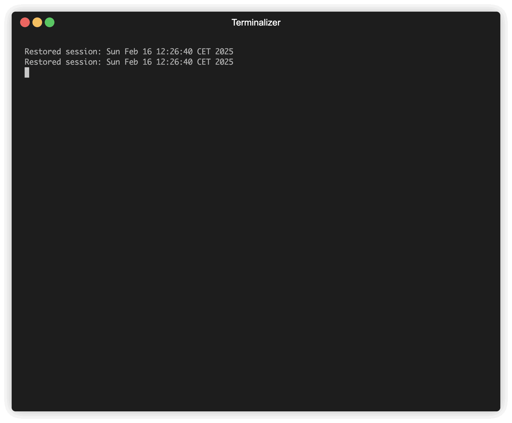

# 🚀 InfraBot


[](https://codecov.io/github/alaeddine-13/infrabot)

Create resource on the cloud with natural language using AI-powered Terraform generation




Live App: https://cloud-agent-workbench-alaeddineabdess.replit.app/


## 📖 Features

* Natural language-based resource creation
* Support for AWS cloud resources (S3 buckets, EC2 instances, etc.)
* Local infrastructure development using LocalStack
* Component-based infrastructure management
* Interactive chat interface for cloud resources
* Support for multiple infrastructure components
* Self-healing infrastructure creation with automatic error fixing

## 🛠️ Prerequisites

- Python 3.10 or higher
- Required packages (to be installed via pip):
  ```bash
  pip install infrabot
  ```
- Terraform installed:
  ```bash
  brew install terraform
  ```
- AWS CLI configured:
  ```bash
  aws configure
  ```

P.S, make sure to configure the default region as well.
- OpenAI API key:
  ```bash
  export OPENAI_API_KEY='your_api_key_here'
  ```
- For local development:
  ```bash
  docker pull localstack/localstack
  docker run -d -p 4566:4566 localstack/localstack
  ```

## 📚 Command Structure

Initialize a new project:
```bash
infrabot init [--verbose] [--local]
```

Create a new component:
```bash
infrabot component create --prompt "Your infrastructure description" --name component-name [--verbose] [--force] [--model MODEL_NAME] [--self-healing] [--max-attempts N] [--keep-on-failure]
```

Delete all components:
```bash
infrabot component delete [--force]
```

Destroy all components infrastructure:
```bash
infrabot component destroy [--force]
```

Edit a component:
```bash
infrabot component edit component-name
```

Chat about your infrastructure:
```bash
infrabot chat component-name
```

Check InfraBot version:
```bash
infrabot version
```

## 📊 Usage Examples

1. Initialize a new project:
```bash
infrabot init
```

2. Create a web server component with self-healing:
```bash
infrabot component create --prompt "Create an EC2 instance with nginx installed" --name web-server --self-healing
```

3. Create a local S3 bucket for testing:
```bash
infrabot component create --prompt "Create an S3 bucket" --name test-bucket --local
```

4. Create a database component with custom retry attempts:
```bash
infrabot component create --prompt "Set up an RDS instance for PostgreSQL" --name database --self-healing --max-attempts 5
```

5. Chat about your infrastructure:
```bash
infrabot chat web-server
```

## 🗂️ Project Architecture


When you initialize a project, InfraBot creates a `.infrabot` directory with the following structure:

```
.infrabot/
└── default/
    ├── backend.tf
    ├── provider.tf
    ├── component1.tf
    ├── component2.tf
    └── ...
```

Each component is stored as a separate Terraform file in the workspace directory.

## 🔧 Advanced Features

### Self-Healing Infrastructure Creation

InfraBot includes a self-healing feature that automatically fixes Terraform errors during resource creation:

- Enable with `--self-healing` flag
- Set maximum retry attempts with `--max-attempts N` (default: 3)
- Uses AI to analyze errors and fix configuration issues
- Maintains original infrastructure intent while resolving dependencies
- Shows detailed fix explanations for transparency
- Use `--keep-on-failure` to preserve generated Terraform files even when errors occur (useful for debugging)

Example with self-healing:
```bash
infrabot component create \
  --prompt "Create a highly available EC2 setup with auto-scaling" \
  --name ha-web \
  --self-healing \
  --max-attempts 5 \
  --keep-on-failure
```

If Terraform encounters errors during plan or apply:
1. InfraBot analyzes the error output
2. AI suggests fixes while preserving the original intent
3. Retries the operation with fixed configuration
4. Continues until success or max attempts reached
5. If `--keep-on-failure` is set, preserves the generated Terraform files for inspection even if errors occur

### Langfuse Monitoring

InfraBot supports observability and monitoring of AI interactions through Langfuse:

- Install Langfuse:
  ```bash
  pip install langfuse
  ```

- Set up Langfuse credentials:
  ```bash
  export LANGFUSE_PUBLIC_KEY='your_public_key'
  export LANGFUSE_SECRET_KEY='your_secret_key'
  ```

- All AI interactions are automatically logged to your Langfuse dashboard

### Alternative Models

InfraBot supports multiple AI models for infrastructure generation through LiteLLM integration. While OpenAI is the default provider, you can use other models by setting the appropriate API key and specifying the model:

Note: Even when using alternative models, the `OPENAI_API_KEY` environment variable is still required for certain auxiliary tasks within InfraBot.

#### Using Groq Models
```bash
export GROQ_API_KEY='your_api_key'
infrabot component create \
  --name eks-cluster-1 \
  --prompt "create an EKS cluster named MyKubernetesCluster" \
  --self-healing \
  --model "groq/deepseek-r1-distill-llama-70b"
```

#### Using Perplexity Models
```bash
export PERPLEXITY_API_KEY='your_api_key'
infrabot component create \
  --name eks-cluster-1 \
  --prompt "create an EKS cluster named MyKubernetesCluster" \
  --self-healing \
  --model "perplexity/sonar-pro"
```

> **Recommendation**: We recommend using the `perplexity/sonar-pro` model for its enhanced factuality and accuracy in infrastructure generation.

The `--model` flag allows you to specify which model to use for infrastructure generation. Make sure to set the corresponding API key as an environment variable before running the command.

InfraBot supports all models available through LiteLLM (see [LiteLLM Documentation](https://docs.litellm.ai/docs/)), including but not limited to:
- OpenAI (default), for instance: `gpt-4o`, `o3-mini`
- Groq, for instance: `groq/deepseek-r1-distill-llama-70b`
- Perplexity, for instance: `perplexity/sonar-pro`
- Anthropic, for instance: `anthropic/claude-3-5-sonnet`
- Google VertexAI
- AWS Bedrock
- Azure OpenAI
- Hugging Face
- And many more

Each provider requires its own API key to be set as an environment variable. Common examples:
- `OPENAI_API_KEY` for OpenAI models (required for all setups)
- `GROQ_API_KEY` for Groq models
- `PERPLEXITY_API_KEY` for Perplexity models
- `ANTHROPIC_API_KEY` for Anthropic models
- `AZURE_API_KEY` for Azure OpenAI models

Refer to the [LiteLLM documentation](https://docs.litellm.ai/docs/) for the complete list of supported models and their corresponding environment variables.

# InfraBot API Documentation

## Overview

InfraBot is a service that allows you to create and manage infrastructure components using natural language. It leverages AI to convert your text prompts into Terraform code, which can then be used to provision cloud resources.

This documentation is specifically for frontend developers who need to integrate with the InfraBot API.

## Running the InfraBot Server

To run the InfraBot server, use the following command:

```bash
uvicorn infrabot.service:app --host 127.0.0.1 --port 8000
```

### Environment Configuration

Before running the server, ensure you have set up the required environment variables:

```bash
# Required
export OPENAI_API_KEY='your_api_key_here'

# Optional (for alternative models)
export GROQ_API_KEY='your_api_key'  # If using Groq models
export PERPLEXITY_API_KEY='your_api_key'  # If using Perplexity models
export ANTHROPIC_API_KEY='your_api_key'  # If using Anthropic models

# Optional (for monitoring)
export LANGFUSE_PUBLIC_KEY='your_public_key'
export LANGFUSE_SECRET_KEY='your_secret_key'
```

## Docker Usage

You can also run InfraBot as a Docker container:

```bash
docker run -p 8000:8000 \
  -e OPENAI_API_KEY=your_openai_api_key \
  -e AWS_ACCESS_KEY_ID=your_aws_access_key \
  -e AWS_SECRET_ACCESS_KEY=your_aws_secret_key \
  -e AWS_REGION=your_preferred_region \
  alaeddineabdessalem/infrabot
```

The server will be accessible at `http://localhost:8000`.

## API Endpoints

The InfraBot service exposes the following RESTful API endpoints:

### 1. Initialize a Project

Initialize a new InfraBot project with Terraform configuration.

**Endpoint:** `POST /init`

**Request Body:**
```json
{
  "workdir": ".infrabot/default",  // Working directory for the project (optional)
  "verbose": false,                // Show detailed initialization steps (optional)
  "local": false                   // Use localstack for infrastructure (optional)
}
```

**Response:**
```json
{
  "success": true,
  "message": "Project initialized successfully",
  "workdir": ".infrabot/default"
}
```

### 2. Create Infrastructure Component

Create a new infrastructure component based on a natural language prompt.

**Endpoint:** `POST /component/create`

**Request Body:**
```json
{
  "prompt": "Create an S3 bucket with versioning enabled",  // Required: Natural language description
  "name": "main",                                           // Component name (optional)
  "model": "gpt-4o",                                        // AI model to use (optional)
  "self_healing": false,                                    // Auto-fix terraform errors (optional)
  "max_attempts": 3,                                        // Max healing attempts (optional)
  "keep_on_failure": false,                                 // Keep files if error occurs (optional)
  "langfuse_session_id": null,                              // Session ID for tracking (optional)
  "workdir": ".infrabot/default"                            // Working directory (optional)
}
```

**Response:**
```json
{
  "success": true,
  "error_message": "",
  "component_name": "main",
  "terraform_code": "resource \"aws_s3_bucket\" \"example\" { ... }",
  "tfvars_code": "bucket_name = \"my-example-bucket\"",
  "plan_summary": "1 resource to add, 0 to change, 0 to destroy",
  "outputs": {
    "bucket_name": "my-example-bucket",
    "bucket_arn": "arn:aws:s3:::my-example-bucket"
  },
  "self_healing_attempts": 0,
  "fixed_errors": []
}
```

### 3. List Projects

List all InfraBot projects in a specified directory.

**Endpoint:** `GET /projects`

**Query Parameters:**
- `parent_dir` (optional): Directory to scan for InfraBot projects. Default is "."

**Response:**
```json
{
  "success": true,
  "message": "Found 2 InfraBot projects",
  "projects": [
    "/path/to/project1",
    "/path/to/project2"
  ]
}
```

## Usage Examples

### Example: Using curl

#### Initialize a Project

```bash
curl -X POST "http://localhost:8000/init" \
  -H "Content-Type: application/json" \
  -d '{
    "workdir": "service_test/.infrabot/default",
    "verbose": true
  }'
```

#### Create an Infrastructure Component

```bash
curl -X POST "http://localhost:8000/component/create" \
  -H "Content-Type: application/json" \
  -d '{
    "prompt": "Create an S3 bucket called demo-bucket",
    "name": "demo-s3-bucket",
    "model": "perplexity/sonar-pro",
    "self_healing": true,
    "max_attempts": 3,
    "keep_on_failure": true,
    "workdir": "
    service_test/.infrabot/default"
  }'
```

#### List All Projects

```bash
curl -X GET "http://localhost:8000/projects?parent_dir=./"
```

## Error Handling

The API returns appropriate HTTP status codes and error messages:

- `200 OK`: The request was successful
- `400 Bad Request`: The request was invalid (check the error message)
- `500 Internal Server Error`: An unexpected error occurred on the server

When an error occurs, the response will include a detailed error message explaining what went wrong.

## Notes for Frontend Developers

1. All API endpoints accept and return JSON data.
2. For long-running operations (like component creation), consider implementing loading states and error handling in your UI.
3. The component creation process may take some time, especially for complex infrastructure.
4. The `terraform_code` and `tfvars_code` fields in the response can be displayed in a code editor for review.
5. The `plan_summary` field provides a human-readable summary of what changes would be made, which is useful for displaying to users.
